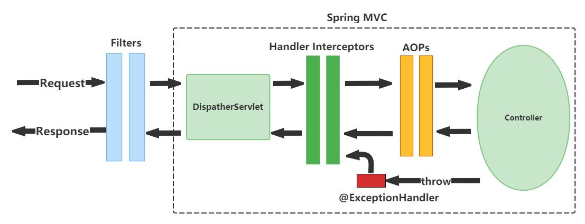

### 请求正常返回时：
```
############TestFilter2 doFilter before############
############TestFilter1 doFilter before############
************TestInterceptor2 preHandle executed**********
************TestInterceptor1 preHandle executed**********
==============Aop2 start=============
==============Aop1 start=============
yongfa365.lifecycle.HomeController hello
==============Aop1 end=============
==============Aop2 end=============
************TestInterceptor1 postHandle executed**********
************TestInterceptor2 postHandle executed**********
************TestInterceptor1 afterCompletion executed**********
************TestInterceptor2 afterCompletion executed**********
############TestFilter1 doFilter after############
############TestFilter2 doFilter after############
```

### 请求异常时：
```
############TestFilter2 doFilter before############
############TestFilter1 doFilter before############
************TestInterceptor2 preHandle executed**********
************TestInterceptor1 preHandle executed**********
==============Aop2 start=============
==============Aop1 start=============
yongfa365.lifecycle.HomeController ping
==============Aop1 end=============
==============Aop2 end=============
Error:报错演示
************TestInterceptor1 afterCompletion executed**********
************TestInterceptor2 afterCompletion executed**********
############TestFilter1 doFilter after############
############TestFilter2 doFilter after############
```
如果要在AOP加个ThreadLocal的创建及remove，看起来并不合适，因为出错后需要这个信息时已经被remove了